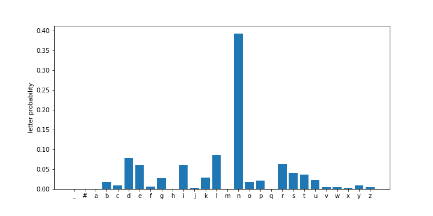

# Playing Hangman with BERT

## What is Hangman?

Hangman is a paper and pencil guessing game for two or more players. 
One player thinks of a word, phrase or sentence and the other(s) tries to guess it by suggesting letters within a certain number of guesses. If none of the people that are guessing the word get it right the person who give the word DOES NOT get the point.
To know more about how to play hangman, check here [Hangman(game)](https://en.wikipedia.org/wiki/Hangman_(game))

# What is BERT?

Anyone familiar with NLP would know the name of BERT, a pre-train
neural network model for natural language processing. It achieves
many state-of-art performance in various tasks. Here, I am going 
to use the idea of BERT to play the game of hangman.

# Why develop the project?
This project comes from an interview when the interviewer asks me
to develop a bot to play the game of hangman. I wrote a simple 
bot with handwritten rules to guess the most probable letter. But
deep down in my heart, I know it can be solved by using the techniques
in deep learning.

# Structure

The project used the transformer structure in paper, "Attention is all you need".
And instead of a encoder-decoder structure, similar to BERT, I only
took the encoder part. 

And similar to BERT MLM task, I masked 40% of the letters as the input
to train the model, where the label is the full unmasked word. And instead of ReLU activation function, I used the
GELU function.


# Version 1

By using positional encoding, char embedding, attention,
 and a fully connected layer, the encoder outputs the probability
 of 26 letters at each position. And the neural network loss is calculated as the
 cross entropy between the probability and the label, only on the masked
 letters.
 
# Version 2

Version 1 model has a very obvious disadvantage, that it outputs
the probability at each masked position. However, to play hangman,
we only want to know the most probable letter at each guessing time.
To achieve that, I add a MaxPooling in the final layer, which is 
telling the model to give the most probable letter. And loss function
becomes the KL divergence loss between the probability distribution of the
most probable letter and the true prob distribution of the masked word.

For example, input: ##llo, label: hello

The model outputs a vector length of 26, each giving the probability
of that corresponding letter. And the label, is 

a, b, c, d, e, f, g, h, ...

[0, 0, 0, 0, 0.5, 0, 0, 0.5, ...]


# Version 3

The above model didn't take advantage of the fact that during 
the game, unmasked letters won't be the masked letters. So in the
final layer, before calculating the probability of each letter,
I assign -inf to the scores of the guessed letters.

# Model Attention

Example: 

masked word: ha##ma#  
original word: hangman




The model is mostly paying attention to letter 'm' and 
'a' and letter 'n' has the highest probability among letters
to show up in the word.


# Performance

Small model achieves a success rate 42%, big model
achieves a success rate 60%.

# Play Hangman

To train your model, run:

```python run_v3.py```

To play the game, run:

```python hangmanServer.py```


# Other Thoughts

Version 3 model isn't really perfect, as it's not taking the 
wrongly guessed letters during the game into account. To use
that information, maybe it would require bigger dataset containing
the wrongly guessed letters or other network structure.


Could you build a hangman player to beat mine? Use my code to try.


